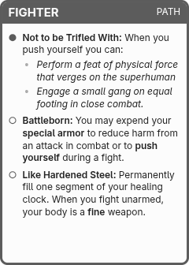

# Card Forge

Use this Obsidian plugin to turn your notes into printable cards. This plugin is very much in-development, however if you are interested in contributing please feel free to get in touch (or file an issue).

## Example

## Usage

1. Use the command "Card Forge: Open Preview" to open the preview window
2. Create or open a note
3. The note will be rendered in a 2.5"x3.5" poker card

You can customize the card via these frontmatter properties:

- **card-forge-type**: A string or emoji that will be placed in the top right of the card.
- **card-forge-title**: A custom title to use for the card (defaults to the note title).
- **cssclasses**: Additional CSS class names to apply to the card.
